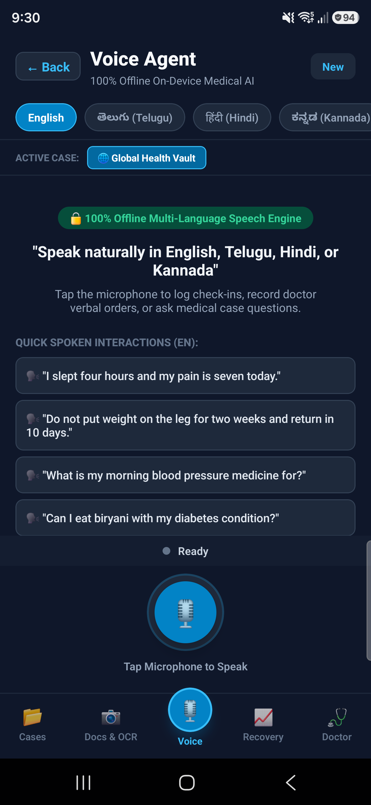
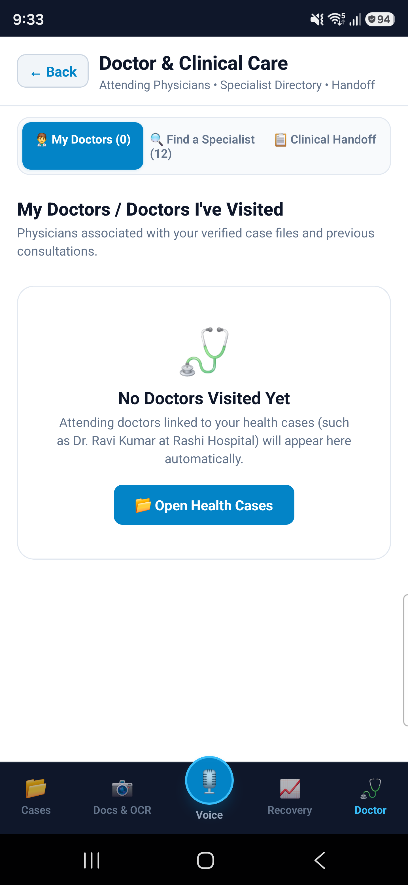
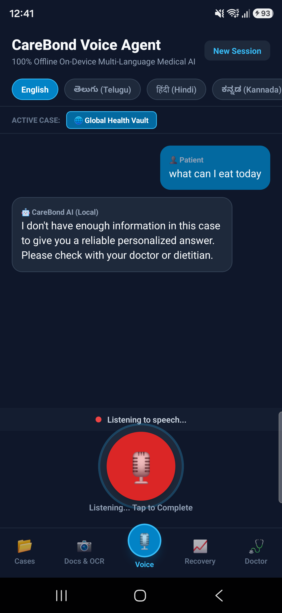
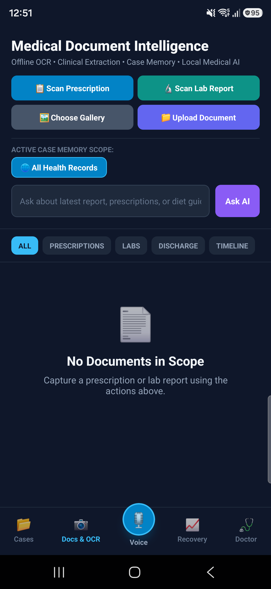
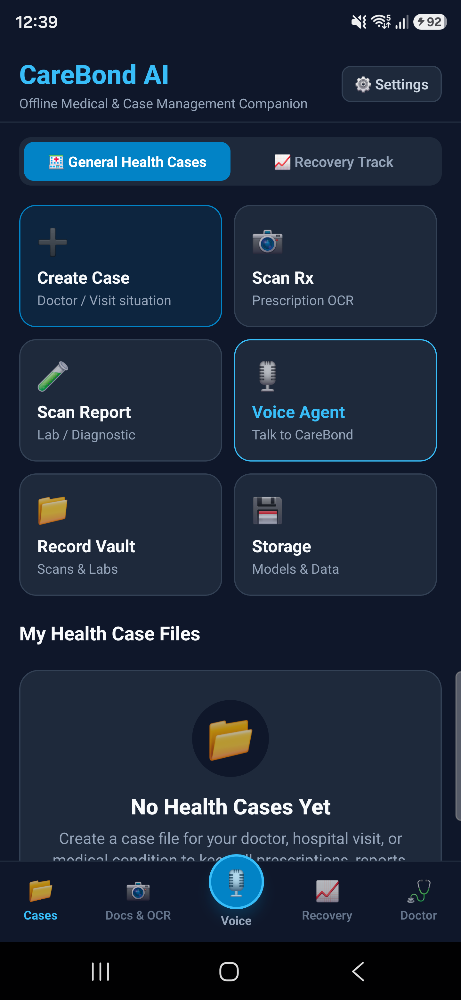

# CareBond AI

**Offline Medical Companion — Android Prototype**

> A privacy-first, on-device clinical and recovery assistant designed to help patients and caregivers organize medical records, interpret prescriptions, track recovery baselines, and prepare doctor handoffs—**without a single byte of sensitive health data leaving the phone.**

[](https://github.com/lokeshmudunuri/medibond-ai/releases/tag/v1.0.0-jury)
[](https://github.com/lokeshmudunuri/medibond-ai)
[](LICENSE)
[](https://github.com/lokeshmudunuri/medibond-ai/releases/tag/v1.0.0-jury)

---

# 🚀 JURY QUICK START

**Judges and evaluators do NOT need to clone this repository or set up a React Native / Android development environment to evaluate CareBond AI.**

You can install and test the complete Android prototype in **under 2 minutes**:

1. **Download the APK directly to your Android device:**
   * 📲 **[Download CareBondAI-Jury-Demo.apk](https://github.com/lokeshmudunuri/medibond-ai/releases/download/v1.0.0-jury/CareBondAI-Jury-Demo.apk)** *(~168 MB)*
   * 🏷️ **GitHub Release Page:** [https://github.com/lokeshmudunuri/medibond-ai/releases/tag/v1.0.0-jury](https://github.com/lokeshmudunuri/medibond-ai/releases/tag/v1.0.0-jury)
   * 🔒 **SHA-256 Checksum:** `51f80a0b1f9664111274a2fa776bbc4b8ede32a02625fe5f70a9b074af34156e`
2. **Install the APK:**
   * Open the downloaded file. When Android prompts *"Install unknown apps"*, tap **Settings** -> enable **Allow from this source**, then tap **Install**.
3. **Launch CareBond AI:**
   * Tap the **CareBond AI** icon in your app launcher.
4. **Follow the 5-Minute Jury Demo Script:**
   * 📖 **[Read the Step-by-Step Jury Testing Guide](docs/JURY_TEST_GUIDE.md)** for 5 guided tests covering Case Isolation, Document Vault, Emergency Safety, Recovery Check-in, and 100% Airplane Mode verification.

---

## 1. The Healthcare Problem

Patients and caregivers face critical pain points in modern healthcare:
* **Fragmented Health History:** Prescriptions, discharge summaries, and lab reports are scattered across paper documents, PDF files, and WhatsApp chats, leading to lost clinical context during doctor visits.
* **Complex Clinical Jargon:** Patients struggle to decipher doctor handwriting, dosage instructions, and lab values, often resorting to unverified internet searches.
* **Post-Discharge Blindspots:** After leaving the hospital, patients and caretakers lack structured, objective tools to track pain, mobility, and symptom baselines, making follow-up consultations anecdotal rather than data-driven.
* **Extreme Privacy Hazards:** Uploading sensitive prescriptions, lab reports, and daily medical logs to public cloud LLMs creates catastrophic HIPAA/GDPR privacy liabilities and corporate data harvesting risks.

---

## 2. The CareBond AI Solution

CareBond AI provides an **offline-first medical companion** that runs local intelligence directly on the user's Android phone. The application is structured around two synchronized care tracks:

```text
                                CAREBOND AI
                                     │
                 ┌───────────────────┴───────────────────┐
                 │                                       │
                 ▼                                       ▼
       GENERAL HEALTH TRACK                    RECOVERY / CARETAKER TRACK
     • Clinical Case Files                   • Doctor Instructions & Protocol
     • Prescription & Document Vault         • Daily Symptom & Pain Check-in
     • Local Medication Memory               • Objective Recovery Trends (7-Day)
     • Patient-Friendly Explanations         • Medication Adherence Tracking
     • Deterministic Safety Guardrails       • Structured Doctor Handoff Brief
```

### General Health Track
* **Isolated Case Files:** Partition medical data by clinical episode (e.g. *Type 2 Diabetes* vs. *Knee Replacement*). No cross-condition contamination.
* **Document Vault:** Ingest paper prescriptions, diagnostic lab reports, and discharge notes.
* **Medication Intelligence:** Tracks drug schedules, dosages, and frequencies with clear provenance markers (`[VERIFIED]` vs `[REQUIRES REVIEW]`).
* **Timeline & Memory:** Maintains an immutable local timeline of symptoms, medication changes, and clinical observations.

### Recovery / Caretaker Track
* **Doctor Instructions Engine:** Digitizes post-op recovery orders and care instructions into actionable daily checklists.
* **Objective Daily Check-ins:** Records pain severity (0–10 scale), pain locations, daily mobility/steps, and recovery symptoms.
* **Continuous Baseline Monitoring:** Automatically calculates 7-day moving recovery trends.
* **Doctor Handoff Generator:** Automatically compiles a concise, high-density clinical summary formatted specifically for physician review during follow-up visits.

---

## 3. Why 100% Offline AI?

| Cloud Health Apps | CareBond AI (Offline-First) |
|---|---|
| ❌ Sensitive prescriptions uploaded to cloud servers | ✅ **100% on-device processing; zero health data leaves the phone** |
| ❌ Fails or hangs in low-connectivity areas (rural / transit) | ✅ **Operates identically in Airplane Mode with zero network access** |
| ❌ High latency and recurring cloud API costs | ✅ **Instant local database queries and on-device GGUF inference** |
| ❌ Opaque cloud logging and corporate data retention | ✅ **Sandboxed local storage encrypted with Android hardware keystore** |

---

## 4. Current System Architecture

```text
User
 ↓
CareBond AI (React Native 0.77.3 on Android)
 ├── General Health Track
 │    ├── Case Files (useCaseStore)
 │    └── Document Vault (DocumentVaultService)
 └── Recovery / Caretaker Track
      ├── Doctor Instructions
      └── Daily Check-ins (RecoveryEngine)
 ↓
Offline Health Memory & Database
 ↓
AI Orchestrator (src/ai/AIOrchestrator.ts)
 ├── Emergency Safety Engine (Deterministic Red-Flag Interceptor)
 ├── Medication Safety Checker (Allergy & Duplicate Therapy Rules)
 ├── Case Context Filter (Strict Active Case Scoping)
 └── Model Router (Task & Model Profile Selector)
 ↓
Local AI Engine (src/ai/LocalLLMEngine.ts)
 React Native
 → llama.rn Bridge (v0.13.0-rc.6)
 → native llama.cpp (C++)
 → Quantized GGUF Models (MedGemma 4B / Gemma 4 / etc.)
 ↓
Android Runtime (arm64-v8a / CPU & NPU Acceleration)
```

```text
Base Architecture Contract

CareBond AI strictly adheres to the fixed core architecture contract:

text
                         CAREBOND AI
                              │
          ┌───────────────────┴───────────────────┐
          │                                       │
          ▼                                       ▼
       MODE A                                   MODE B
   EVERYDAY HEALTH                           RECOVERY
          │                                       │
          └───────────────────┬───────────────────┘
                              ▼
                    SHARED HEALTH CORE
                              │
        ┌─────────────────────┼─────────────────────┐
        ▼                     ▼                     ▼
      VOICE                 DOCUMENT              SENSORS
        │                     │                     │
       STT                   OCR              Signal Processing
        │                     │                     │
      Intent              Medical NER        Personal Baseline
        │                     │                     │
        └─────────────────────┼─────────────────────┘
                              ▼
                       HEALTH MEMORY
                              │
                              ▼
                  PERSONAL HEALTH CONTEXT
                              │
        ┌─────────────────────┼─────────────────────┐
        │                     │                     │
        ▼                     ▼                     ▼
   Medical KB          Medication Safety       Recovery Engine
        │                     │                     │
        └─────────────────────┼─────────────────────┘
                              ▼
                    MEDICAL REASONING
                              │
                    ┌─────────┴─────────┐
                    │                   │
              LIGHT MODEL          MEDGEMMA 4B
              4GB PROFILE          6GB+ PROFILE
                    │                   │
                    └─────────┬─────────┘
                              ▼
                       SAFETY VALIDATION
                              │
                              ▼
                   HEALTH CONTEXT ENGINE
                              │
                              ▼
                    DOCTOR HANDOFF ENGINE
                              │
               ┌──────────────┼──────────────┐
               ▼              ▼              ▼
            Patient        Specialist       Doctor
            Summary         Summary         Summary
                              │
                              ▼
                           TTS / UI

```
---
---

## 5. Current Prototype Features & Verification Status

We uphold total honesty regarding the verification status of all capabilities in this prototype checkpoint:

| Feature Area | Component | Status | How to Test in the Demo |
|---|---|:---:|---|
| **Case Files** | Isolated Case Management | ✅ **Verified** | Tap **+ New Case**, create cases, switch cases in header. Verify timeline isolation. |
| **Document Vault** | Medical Record Storage | ✅ **Verified** | In **Documents** tab, tap upload/scan to view sample prescriptions and records. |
| **Safety Guardrails** | Emergency Safety Engine | ✅ **Verified** | Ask *"I have severe chest pain"* in Chat. Immediate emergency screen triggers. |
| **Safety Guardrails** | Medication Conflict Check | ✅ **Verified** | Ingest duplicate NSAID or antibiotic; safety alert notifies user. |
| **Recovery Engine** | Daily Check-ins & Trends | ✅ **Verified** | In **Recovery** tab, log pain (0-10), symptoms, and view 7-day trend analysis. |
| **Doctor Handoff** | Clinical Brief Export | ✅ **Verified** | Tap **"Generate Doctor Handoff"** in Recovery to view provenance-tagged summary. |
| **Storage Manager** | Safe Storage Breakdown | ✅ **Verified** | Open **Storage** tab. View model/vault breakdown and tap **Clear Cache** safely. |
| **Offline Runtime** | Airplane Mode Verification | ✅ **Verified** | Enable Airplane Mode; verify cases, docs, recovery, and safety run without network. |
| **Local LLM Engine** | llama.rn Native C++ Bridge | ✅ **Verified** | Native `llama.rn` library compiles cleanly into Android release APK (`arm64-v8a`). |
| **OCR Handwriting** | Native OCR Pipeline | ⚠️ **Experimental** | Heuristic NER parses standard prescriptions; ambiguous text marked `[REQUIRES REVIEW]`. |
| **Model Downloader** | Native GGUF Downloader | ⚠️ **Experimental** | Native chunked download engine implemented; upstream HF filename resolver in progress. |
| **Multilingual Voice** | Hindi & Kannada Offline STT | 🚧 **In Progress** | Native Android speech recognition bridge in active development. |
| **Samsung Health** | Samsung Health Data SDK | 🚧 **In Progress** | Native Samsung Health SDK background bridge planned for Phase 10. |

---

## 6. Real Device Screenshots (Samsung Galaxy S24 Ultra)

The prototype has been validated on a physical Samsung Galaxy S24 Ultra (`SM-S928B`):

| Ai voice Agent| Doctor Handoff | voice Agent in work |
|:---:|:---:|:---:|
|  |  |  |

 | Medical Documents scanning | Interface Dashboard |
|:---:|:---:|
  |  |

---

## 7. Medical Safety & Clinical Disclaimer

> [!IMPORTANT]
> ### Clinical Disclaimer
> CareBond AI is an investigational prototype built for hackathon demonstration. It is designed to assist patients in organizing personal records and preparing structured observations for their doctors. **It does NOT provide medical diagnoses, prescribe treatments, or replace professional clinical judgment.**
> 
> * **Deterministic Overrides:** All emergency and allergy guardrails operate via deterministic rule sets that take precedence over any LLM generation.
> * **Human-in-the-Loop:** Incomplete, faint, or ambiguous handwritten prescriptions are flagged with a mandatory `[REQUIRES REVIEW]` prompt requiring explicit human confirmation.

---

## 8. Documentation Index

* 🚀 **[Jury Testing Guide](docs/JURY_TEST_GUIDE.md):** Step-by-step instructions and 5-minute evaluation script.
* 📦 **[Model Setup & Management](docs/MODEL_SETUP.md):** GGUF model profiles, storage specifications, and sideloading instructions.
* 🏗️ **[System Architecture](docs/ARCHITECTURE.md):** Detailed layer breakdown, data flow, and implemented vs. planned matrix.
* 🛠️ **[Jury Troubleshooting Guide](docs/TROUBLESHOOTING.md):** Common Android install questions and quick solutions.
* 📋 **[Release Checkpoint Report](docs/RELEASE_CHECKPOINT_REPORT.md):** Forensic verification metrics, build results, and SHA-256 hashes.
