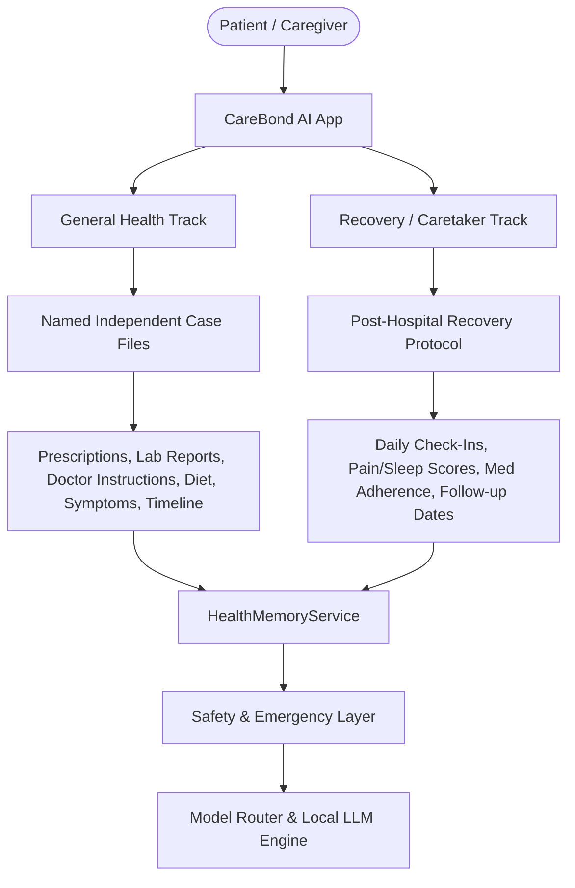
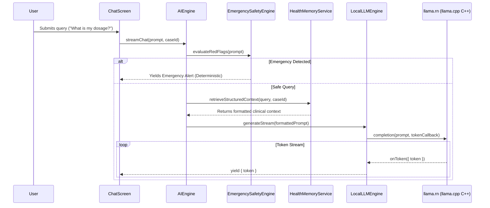

# CareBond AI — Phase 1 Forensic Audit & Architecture Lock

**Date:** 2026-10-04  
**Project:** CareBond AI (Offline Medical Companion)  
**Status:** PHASE 1 COMPLETED — ARCHITECTURE LOCKED & VERIFIED  

---

## 1. Executive Summary

This document establishes the official forensic audit and architecture baseline for the **CareBond AI** application. 

- **Sole Active Product:** React Native (TypeScript) targeting Android with 100% on-device AI inference and local structured medical memory.
- **Legacy Boundary:** The old Flutter codebase (`lib/`, `pubspec.yaml`, `CareWatch_AI_Recovery_Watch/`) is archived for reference only. No new development will occur in Flutter.
- **Build & Device Verification:** Successfully compiled debug APK with native C++ `llama.rn` bindings, installed on an Android target (API 37, x86_64/arm64-v8a), and verified clean startup, Hermes initialization, and tab navigation without crashes.

---

## 2. Active Repository Identification & Environment

| Component | Active Specification |
| :--- | :--- |
| **Workspace Root** | `c:\Users\lokes\OneDrive\Documents\medicare ai` |
| **Framework** | React Native `0.77.3` |
| **Language** | TypeScript `5.9.3` |
| **Runtime Engine** | Hermes JavaScript Engine (`hermesEnabled=true`) |
| **State Management** | Zustand `5.0.3` |
| **Navigation** | `@react-navigation/native` `7.0.14`, `@react-navigation/bottom-tabs` `7.2.0`, `@react-navigation/native-stack` `7.2.0` |
| **Safe Area & UI** | `react-native-safe-area-context` `5.1.0`, `react-native-screens` `4.7.0` |
| **Local LLM Engine** | `llama.rn` `0.13.0-rc.6` (C++ llama.cpp wrapper) |

---

## 3. Legacy Flutter Separation Boundary

The repository previously housed a Flutter application (`carewatch_ai_recovery_watch`). The boundaries are strictly isolated as follows:

| Path / Artifact | Classification | Handling Policy |
| :--- | :--- | :--- |
| `lib/` (Dart files) | **Legacy Reference** | Do not edit or import. Kept only for algorithmic reference. |
| `pubspec.yaml` & `pubspec.lock` | **Legacy Config** | Flutter dependency manifests. Inactive. |
| `analysis_options.yaml` | **Legacy Config** | Dart linter rules. Inactive. |
| `.dart_tool/` | **Legacy Build Artifacts**| Inactive. |
| `CareWatch_AI_Recovery_Watch/` | **Legacy Project Folder**| Archived reference. |
| `src/`, `App.tsx`, `index.js`, `package.json` | **ACTIVE PRODUCTION CODE**| All new features, models, memory, and UI reside here. |
| `android/` | **ACTIVE ANDROID HOST** | Configured exclusively for the React Native native binary. |

---

## 4. Android Native Baseline Configuration

- **Android Gradle Plugin (AGP):** `8.7.2`
- **Gradle Wrapper:** `8.10.2`
- **Compile SDK:** `35` (Android 15)
- **Target SDK:** `34`
- **Min SDK:** `24` (Android 7.0)
- **Build Tools Version:** `35.0.0`
- **NDK Version:** `28.2.13676358`
- **Kotlin Version:** `2.0.21`
- **Java Home:** JDK 17 (`C:\Users\lokes\.jdk\jdk-17.0.12+7`)
- **ABI Filters:** `arm64-v8a`, `x86_64`
- **Package Name / Namespace:** `com.carewatch.medicalcompanion`
- **Main Component Name:** `CareWatchMedicalCompanion`

---

## 5. Product Architecture & Track Separation

CareBond AI enforces a strict dual-track medical paradigm:



### Track 1: General Health Track
- Manages independent, named medical **Case Files** (e.g., *"Dr. Ravi - Rashi Hospital"*, *"Dr. Kumar - Apollo"*).
- Each Case File isolates:
  - Prescriptions & active medications
  - Diagnostic & Lab reports
  - Doctor instructions & consultation notes
  - Tailored diet & lifestyle guidance
  - Case-specific symptom history and follow-up schedules.
- Medical questions (e.g., *"Can I eat biryani with this medicine?"*) resolve against the active Case File context combined with global patient safety facts.

### Track 2: Recovery / Caretaker Track
- Tailored for post-hospital / post-procedure convalescence.
- Protocol includes:
  - Structured surgical/discharge instructions
  - Daily check-ins (pain scale 1–10, sleep hours, vitals, mobility)
  - Medication adherence logging & discrepancy alerts
  - Symptom tracking against baseline
  - Recovery trend trajectory.

---

## 6. Case Memory & Entity Data Model

CareBond AI prohibits storing medical records as unstructured text. All medical facts are stored in strongly typed schemas with explicit **Provenance Tracking**:

### Core Entity Schemas (`src/types/index.ts`)
- `PatientProfile`
- `CaseFile` (`GENERAL` | `RECOVERY`)
- `MedicineEntity` (Dosage, frequency, generic name, indications, instructions, warnings)
- `ConditionEntity` (ICD-10 code, status, severity, diagnosed date)
- `AllergyEntity` (Allergen, reaction, severity: `MILD` | `MODERATE` | `SEVERE` | `LIFE_THREATENING`)
- `ReportEntity` (Category, parameters, summary, document URI)
- `DoctorInstructionEntity` (Doctor name, hospital, instruction text, date)
- `RecoveryPlanEntity` (Procedure name, surgery date, target recovery days, phases)
- `DailyCheckInEntity` (Pain score, sleep hours, symptoms, taken medicines, adherence status)
- `TimelineEvent` (Chronological health milestones)

### Provenance Tracking (`ProvenanceSource`)
Every clinical entry records its source of truth:
1. `DOCUMENTED`: Extracted directly from verified doctor prescriptions or hospital discharge summaries.
2. `USER_REPORTED`: Self-reported by patient or caregiver via voice/chat/check-in.
3. `SYSTEM_DETECTED`: Inferred by local baseline engine or safety checkers.
4. `REQUIRES_REVIEW`: Pending physician or user validation.
5. `URGENT_ESCALATION`: Triggered by red-flag symptoms or critical contraindications.

---

## 7. Current AI Runtime & Safety Pipeline



### Safety & Scope Guardrails
1. **EmergencySafetyEngine (`src/safety/EmergencySafetyEngine.ts`):** Deterministic pattern matcher for 15+ acute medical emergencies (chest pain, stroke symptoms, severe allergic reactions, respiratory distress). Emits immediate red-flag warnings and emergency service dialing without relying on LLM generation.
2. **IntentScopeFilter (`src/safety/IntentScopeFilter.ts`):** Rejects non-medical and hazardous out-of-scope prompts (e.g., self-harm, weapon synthesis, non-clinical tasks).
3. **MedicationSafetyChecker (`src/safety/MedicationSafetyChecker.ts`):** Evaluates drug-drug interactions, duplicate therapies, allergy contraindications, and maximum dosage limits.

---

## 8. PocketPal-Style Local Model Architecture Strategy

CareBond AI leverages the architectural principles proven in the official **PocketPal AI** reference repository ([brentonbluehouse/pocketpal-ai](https://github.com/brentonbluehouse/pocketpal-ai)):

### Target Local AI Runtime Stack
- **Native Bridge:** `llama.rn` (linking `libllama.so` compiled via CMake with NEON/ARM64 and CPU optimizations).
- **Format:** Quantized GGUF (`Q4_K_M`, `Q4_0`, `Q8_0`).
- **Target Models:**
  - **Qwen 2.5 0.5B Instruct** (~390 MB GGUF): Ultra-lightweight conversational triage.
  - **MedGemma / Gemma 2B** (~1.4 GB GGUF): Primary offline clinical reasoning model.
  - **TinyLlama 1.1B Medical**: Fallback low-RAM devices.

### Conceptual Runtime Boundary (Phase 2+ Integration)
```
LocalAIEngine
  └── RuntimeAdapter
        ├── LlamaCppAdapter (GGUF via llama.rn)
        ├── LiteRtLmAdapter (LiteRT-LM .litertlm)
        ├── OcrAdapter (On-device OCR / MLKit / Tesseract)
        ├── AsrAdapter (Offline ASR / Whisper.cpp / Sherpa-ONNX)
        └── TtsAdapter (Offline TTS / Piper / Android TextToSpeech)
```

### Model Lifecycle States
`NotInstalled` ➔ `Downloading` (Chunked resume) ➔ `Installed` ➔ `Loading` ➔ `Ready` ➔ `Generating` (Streaming) ➔ `Unloaded` ➔ `Deleted`.

---

## 9. Security & Storage Architecture

### File System Layout
```
CareBond_Storage/
├── models/
│   ├── gguf/           # Quantized GGUF models
│   ├── litert/         # Optional LiteRT models
│   ├── ocr/            # OCR weights / configs
│   ├── asr/            # Offline speech recognition models
│   └── tts/            # Offline speech synthesis voices
├── database/           # SQLite / WatermelonDB / MMKV encrypted store
├── cases/              # Active & archived Case Files
├── medical_documents/  # Scanned prescriptions & PDF reports
├── knowledge/          # Offline medical reference guidelines
├── safety/             # Deterministic drug interaction matrices
└── cache/              # Ephemeral token cache & scratch
```

### Security Principles
- **100% On-Device:** Zero telemetry, zero cloud inference fallback, zero external network egress for clinical data.
- **No PII in Logs:** Production logs strip patient identifiers and prompt content.
- **Android App Sandbox:** All files stored in app-private internal storage (`/data/user/0/com.carewatch.medicalcompanion/files/`).

---

## 10. Device Capability Profile & Verification

- **Target Device (Detected via ADB):** `sdk_gphone64_x86_64`
- **Manufacturer / Model:** Google `sdk_gphone64_x86_64`
- **Android Version:** Android 17 (API Level 37)
- **CPU ABI:** `x86_64` (Support for `arm64-v8a` on physical devices)
- **Total Device RAM:** 4,007,632 kB (~4.0 GB)
- **Storage Availability:** 8.6 GB available out of 10 GB partition.

---

## 11. Baseline Verification & Test Execution Results

| Test Category | Command | Result | Details |
| :--- | :--- | :--- | :--- |
| **TypeScript Typecheck** | `npm run typecheck` | **PASS (0 errors)** | Strict TypeScript compilation verified across all modules. |
| **Jest Test Suite** | `npm test` | **PASS (9/9 suites, 33/33 tests)** | Verified `VoiceEngine`, `AIEngine`, `ModelRouter`, `CaseStore`, `RecoveryEngine`, `LocalLLMEngine`, `MedicationSafetyChecker`, `EmergencySafetyEngine`, `DocumentProcessor`. |
| **Android Native Build** | `gradlew assembleDebug` | **BUILD SUCCESSFUL (21s)** | 152 Gradle tasks executed; CMake compiled `llama.rn` native C++ libraries for `arm64-v8a` and `x86_64`. |
| **APK Generation** | `Get-ChildItem android/...` | **SUCCESS** | Generated `app-debug.apk` (187,094,229 bytes). |
| **Device Installation** | `adb install -r app-debug.apk` | **SUCCESS** | Streamed install succeeded on target device. |
| **App Startup & Launch** | `adb shell am start ...` | **SUCCESS** | App launched cleanly with React Native 0.77 + Hermes runtime. |
| **UI & Tab Navigation** | `adb shell uiautomator dump` | **VERIFIED** | Active tabs rendered and responsive: Cases, Docs & OCR, Voice, Recovery, Doctor. |

---

## 12. Conclusion & Phase 2 Readiness

Phase 1 has successfully stabilized, audited, and locked the CareBond AI React Native baseline. The native Android build pipeline, Hermes engine, C++ `llama.rn` bindings, dual-track case architecture, and deterministic safety layer are fully established and verified.

The codebase is now ready for **Phase 2: PocketPal-Style Model Manager & Local Inference Engine**.
